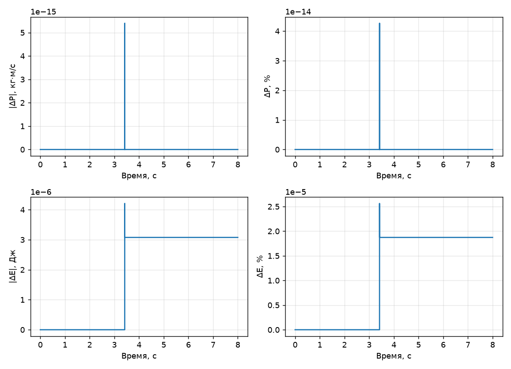
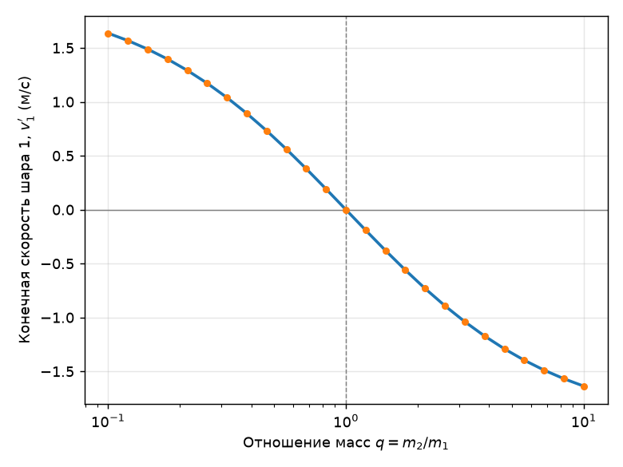
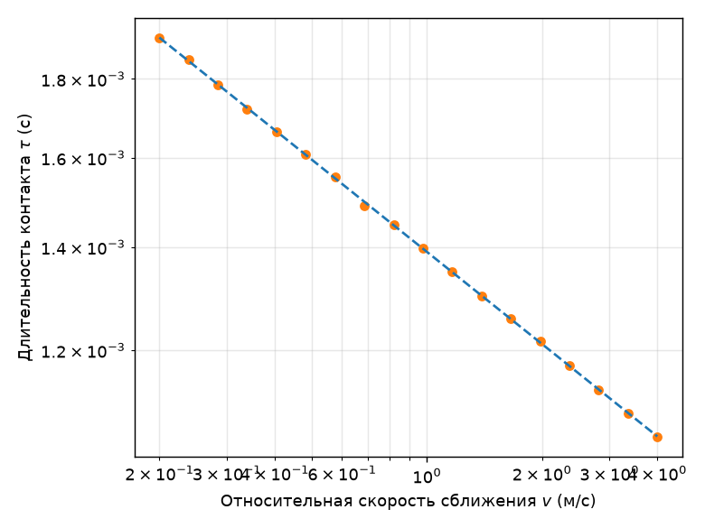

# Отчёт по моделированию столкновения бильярдных шаров

## 1. Постановка задачи

Моделируется столкновение двух гладких деформируемых шаров на плоскости.

$$
F(\delta) = k * \delta^{3/2}, \qquad \delta = r_1 + r_2 - |\vec r_1 - \vec r_2|,
$$

Движение рассчитывается численным решением второго закона Ньютона. Трение и вращение шаров не учитываются. Рассматривается только поступательное движение. Удар считается идеально гладким.

## 2. Входные параметры и их ограничения

| Параметр | Ограничение | Обоснование |
|---|---|---|
| Масса `m` | $m > 0$ | для корректности второго закона Ньютона |
| Радиус `r` | $r > 0$ | при $r \le 0$ закон Герца не определён |
| Начальное положение шаров `p1` и `p2` | $\vert \vec p_1 - \vec p_2 \vert \ge r_1+r_2$ | шары не должны стартовать уже перекрытыми |
| Жёсткость `k` | $k>0$, по умолчанию $6.4\times10^8$ | подобрана так, чтобы деформация оставалась малой относительно радиусов при заданных массах/скоростях |
| Промежутки времени `t_span` | покрывают сближение, контакт и разлёт шаров | подобраны специально под сценарии |
| Допуски проверки ЗСИ/ЗСЭ `rtol` и `atol` | $10^{-3}$ — $10^{-9}$ | допустимое отклонение импульса/энергии от начального значения — не ноль из-за конечной точности интегрирования |

## 3. Выходные параметры и визуализация

### 3.1. Выходные параметры

- Результат интегрирования — траектория движения <$\vec{p_1}(t)$, $\vec{v_1}(t)$, $\vec{p_2}(t)$, $\vec{v_2}(t)$>, где $\vec{p_1}(t)$ и $\vec{p_2}(t)$ — позиции шаров, $\vec{v_1}(t)$ и $\vec{v_2}(t)$ — скорости шаров;
- Cуммарный импульс системы $\vec P(t) = m_1\vec v_1(t) + m_2\vec v_2(t)$;
- Полная механическая энергия $E(t) = E_{кин}(t) + E_{герц}(t)$, где $E_{герц} = \tfrac{2}{5}k\delta^{5/2}$;
- Отклонения импульса/энергии от начальных значений (абсолютные и относительные);
- Ожидаемые скорости после удара по аналитической формуле упругого столкновения.

### 3.2. Визуализация

1. Анимация движения шаров на плоскости с замедлением непосредственно в момент контакта для наглядности деформации;
2. Четыре графика: абсолютное и относительное отклонение импульса, абсолютное и относительное отклонение энергии.

## 4. Результаты численного эксперимента

### 4.1. Зависимость скорости шара от отношения масс

При лобовом ударе шара $m_1$ (скорость $v_1$) о неподвижный шар $m_2$, конечная скорость первого шара:

$$
v_1' = v_1 * \frac{m_1-m_2}{m_1+m_2},
$$

Эксперимент:
$m_1=5$ кг, $m_2 = m_1 * q$ кг, где $q \in (0.1, 10)$, $v_1=2$ м/с, $r_1=r_2=1$ м

Вывод: симуляция полностью повторяет аналитическую кривую.

### 4.2. Зависимость длительности контакта от скорости сближения

По теории Герца длительность упругого контакта двух сфер масштабируется как

$$
\tau \propto v^{-1/5},
$$

где $v$ — относительная скорость сближения в момент касания.

Эксперимент:
Одинаковые шары ($m_1=m_2=5$ кг, $r_1=r_2=1$ м), скорость сближения менялась от 0.2 до 4 м/с, длительность контакта измерена как интервал времени, на котором $\delta>0$.

Степенная аппроксимация даёт показатель степени $-0.199$. Ожидаемое значение: $-0.2$. Совпадение с точностью до третьего знака.

### 4.3. Проверка по всем восьми базовым сценариям

| Сценарий | max ΔP, кг·м/с | max ΔP, % | max ΔE, Дж | max ΔE, % |
|---|---:|---:|---:|---:|
| head_on_equal_masses_both_moving | 0 | 0 | 1.53e-06 | 3.06e-05 |
| head_on_different_masses_both_moving | 3.55e-15 | 3.55e-14 | 5.25e-06 | 5.25e-05 |
| head_on_equal_masses_second_at_rest | 1.78e-15 | 1.78e-14 | 1.01e-07 | 1.01e-06 |
| head_on_light_ball_hits_heavy_ball_at_rest | 3.55e-15 | 3.55e-14 | 1.42e-06 | 1.42e-05 |
| angled_equal_masses_second_at_rest | 3.55e-15 | 3.55e-14 | 2.45e-07 | 2.45e-06 |
| angled_different_masses_both_moving | 5.40e-15 | 4.27e-14 | 4.21e-06 | 2.56e-05 |
| rear_end_equal_masses | 3.55e-15 | 2.84e-14 | 6.44e-07 | 6.06e-06 |
| different_masses_and_radii_both_moving | 7.94e-15 | 4.90e-14 | 9.09e-07 | 4.44e-06 |

Импульс сохраняется практически точно: отклонение $10^{-15}$–$10^{-14}$, так как вектора сил противонаправлены и действуют вдоль линии центров шаров. Энергия сохраняется хуже: отклонение $10^{-5}$–$10^{-4}$ % из-за резкого, негладкого роста силы Герца в момент контакта, который интегратор не может отследить абсолютно точно.

## 5. Аналитические тесты

В отличие от проверки ЗСИ/ЗСЭ (раздел 4.3), которая лишь показывает самосогласованность модели, этот тест сверяет результат с независимо известным физическим ответом. Конечная скорость каждого шара после удара сравнивается с классической формулой упругого столкновения твёрдых шаров:

$$
u_1' = u_1 - \frac{2m_2}{m_1+m_2} * (u_1-u_2), \qquad
u_2' = u_2 + \frac{2m_1}{m_1+m_2} * (u_1-u_2),
$$

## 6. Особенности выбранных методов

**Допуски `rtol`/`atol`.** В `integrator.py` заданы фиксированные `rtol=1e-8`, `atol=1e-10` — заметно жёстче, чем допуски проверки законов сохранения. Это осознанное разделение: точность самого решателя должна быть значительно выше точности, которую мы хотим проверить, иначе тест на сохранение энергии проверял бы не физику, а точность интегратора.

**Ограничение шага `max_step`.** Ключевая деталь: шаг решателя ограничен сверху

$$
\Delta t_{max} = \frac{r_1+r_2}{10\ * |v_{отн}|},
$$

то есть одна десятая времени, за которое шары в принципе могли бы пройти расстояние, равное сумме радиусов. Без этого ограничения адаптивный шаг `SciPy.integrate.solve_ivp` рискует «перепрыгнуть» короткий момент контакта или войти в него с шагом, слишком грубым для гладкого разрешения силы $\delta^{3/2}$.

**Время моделирования.** Каждый `t_span` в `scenarios.py` подобран вручную так, чтобы гарантированно захватить сближение, контакт и разлёт шаров для конкретных скоростей и расстояний.

## 7. Вывод

Модель корректно описывает упругое столкновение: импульс сохраняется на уровне машинной точности, энергия — с погрешностью не хуже $10^{-4}$ %, а результат совпадает и с независимой аналитикой упругого удара, и с теоретической зависимостью длительности контакта от скорости ($\tau \propto v^{-1/5}$).
